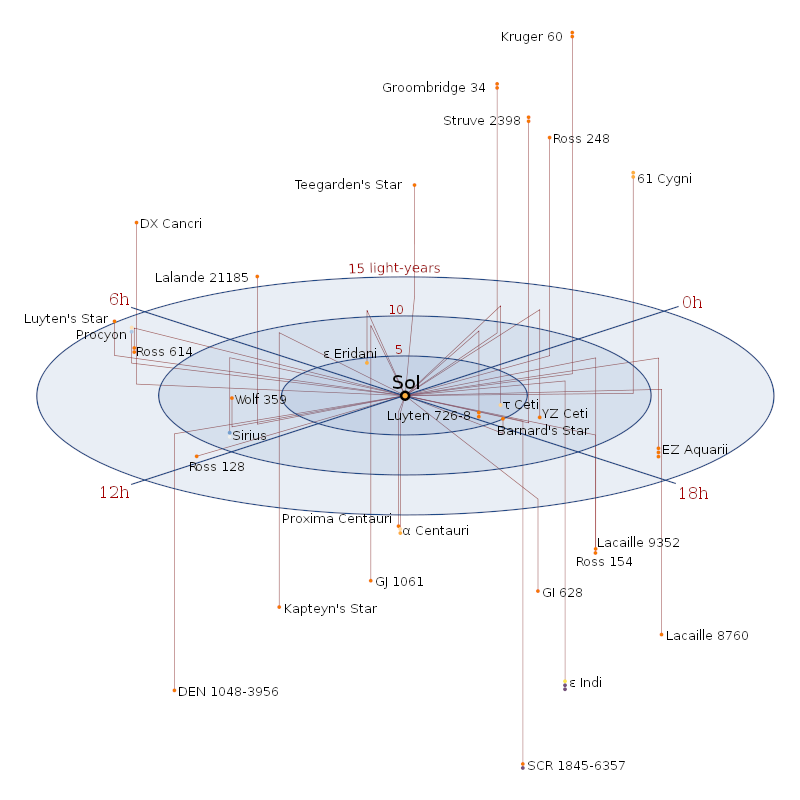

# Local systems

This devices the systems easily reached by [shift drive](./shift-drive.md). This is an approximate 15 light-year area around [Sol](./sol.md). This limit is mostly due to the effort required to map [abyss lanes](./shift-drive.md#navigation).

This is primarially a political definition, and is usually used refer to populated systems except [Sol](./sol.md).

# Alpha Centauri

# Epsilon Eridani

## Epsilon Eridani A
*Volcanic rocky planet*
 * [Planetside](./colonies.md#planetside) mining colony.
 * [Orbital](./colonies.md#orbital)

## Epsilon Eridani B
*Barren planet*
 * [Agrodome orbital](./colonies.md#agrodome)

# Lalande
Officially designated *Lalande 21185*

## Lalande B
*barren planet*
 * Debris field of old [Orbital](./colonies.md#orbital).

## Lalande C
*small gas giant*
 * [Shipyard orbital](./colonies.md#shipyard).

# Teegarden
Officially designated *Teegarden's star*

## Teegarden C
*terrestrial planet*
 * [Teegarden Leeches](./alien-life.md#teegarden-leeches).
 * [Orbital](./colonies.md#orbital) #1
 * [Agrodome Orbital](./colonies.md#agrodome) #2

# Ross 248

# Ross 248 B
*terrestrial planet*
* [Blade grass sea](./alien-life.md#blade-grass-sea)
* [Planetside](./colonies.md#planetside) farming colony

# Kruger 60
*binary star system*

## Kurger 60 AB 1
*tiny barren planet*
* Borisov [Orbital](./colonies.md#orbital)

# Proxima Centauri

## Proxima Centauri C
*tiny barren planet*
* Debris of [Agrodome Orbital](./colonies.md#agrodome)